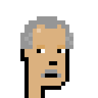
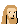
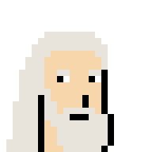
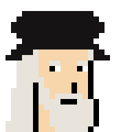
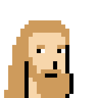
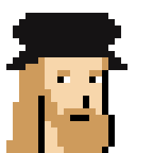
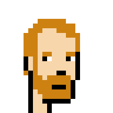
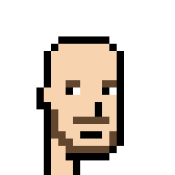

# More Punk Building Blocks in the 24×24px Format

## Vito Corleone ("The Godfather")

base 
hair 
beard 
smoking 
shades 
cigar 

in action 

8x

## Leonardo da Vinci

base 
eyebrows 
hair 
beard 
hat 
 
ginger / blond-ish - eyebrows 
hair 
beard 

in action 

  

8x

  

 

## Vincent van Gogh

base 
eyebrows 
hair 
beard 

in action 

8x

  

## William Shakespeare

> DUKE  Are you a maid? 
> MARIANA  No, my lord. 
> DUKE  A widow, then? 
> MARIANA  Neither, my lord. 
> DUKE  Why you are nothing, then, neither maid, widow, nor wife? 
> LUCIO  My lord, she may be a punk, for many of them are neither maid, widow, nor wife.
>
> Measure for Measure, Act 5, Scene 1

base 
eyebrows 
hair 
beard 
shirt 

in action 

  

8x

  

 

## Questions? Comments?

Post them over at the [Help & Support](https://github.com/geraldb/help) page. Thanks.

